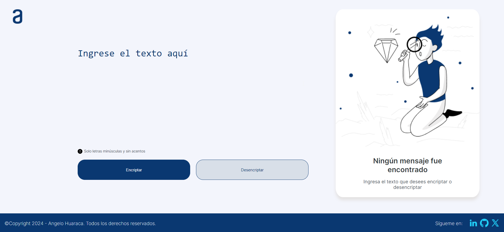
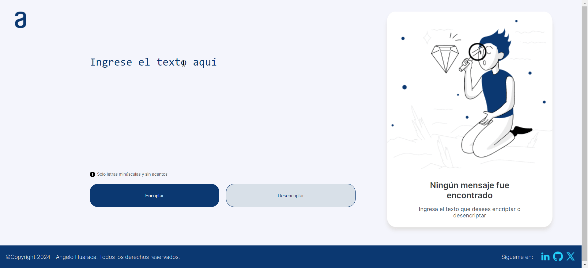

# Encriptador de Texto 🔒

Este proyecto es un encriptador y desencriptador de mensajes. Permite transformar texto en un formato encriptado y luego volver a su forma original. El encriptador utiliza un algoritmo de sustitución simple para ocultar el contenido del mensaje.

## Características Principales 🎬

### Home 🏠



### Función Encriptar 🔐


### Función Desencriptar 🔑


### Función Copiar 📌


### Validación ✅



## Despliegues 📦

Puede visualizar este proyecto en acción en los siguientes recursos:

- GitHub Pages: https://ahuaracab.github.io/encriptador-texto/
- Vercel: https://encriptador-texto-mu.vercel.app/

## Instalación 🔧

Si quiere tener este proyecto y desplegarlo localmente repita los siguientes pasos:

### Pre-requisitos 📋

- Instalar Git
- Instalar Visual Studio Code (Recomendado)
- Instalar plugin Live Server (De Visual Studio Code)

### Ejecución 💻

#### Clonar repositorio

```bash
git clone https://github.com/ahuaracab/encriptador-texto
```

#### Entrar a carpeta de repositorio

```bash
cd encriptador-texto
```

#### Abrir repositorio en Visual Studio Code

```bash
code .
```

#### Ejecutar Live Server

```bash
Click derecho a index.html y seleccionar Open with Live Server
```

## Construido con 🛠️

- [HTML](https://developer.mozilla.org/es/docs/Web/HTML) - Me ayudó a estructurar mi interfaz web. Definí la estructura de mi página con botones, párrafos, áreas de texto, enlaces e imágenes.

- [CSS](https://developer.mozilla.org/es/docs/Web/CSS) - Me permitió dar estilo visual a mi sitio. Apliqué variables, colores, fuentes, márgenes y diseños a los elementos HTML.

- [Flexbox](https://developer.mozilla.org/es/docs/Learn/CSS/CSS_layout/Flexbox) - Lo utilicé para diseñar y organizar los elementos de mi interfaz web. Esta tecnología me permitió crear diseños flexibles y responsivos, adaptándose a diferentes tamaños de pantalla y dispositivos.

- [JavaScript](https://developer.mozilla.org/es/docs/Web/JavaScript) - Fue esencial para implementar la funcionalidad de encriptación y desencriptación. Escribí funciones en JavaScript para manipular el texto, aplicar algoritmos de cifrado y mostrar los resultados en la página.

## Autores ✒️

- **Angelo Huaraca** - _Web Developer_ - [ahuaracab](https://github.com/ahuaracab)

## Licencia 📄

Este proyecto está bajo la Licencia MIT - mire el archivo [LICENSE](LICENSE) para más detalles

## Expresiones de Gratitud 🎁

Quiero agradecer a Alura y Oracle por capacitarme en su programa ONE, sin ellos no hubiera podido tener las herramientas para desarrollar este desafío, el primero de muchos que están por venir! 🎓

---

⌨️ con ❤️ por [Angelo Huaraca](https://github.com/ahuaracab) 😊
